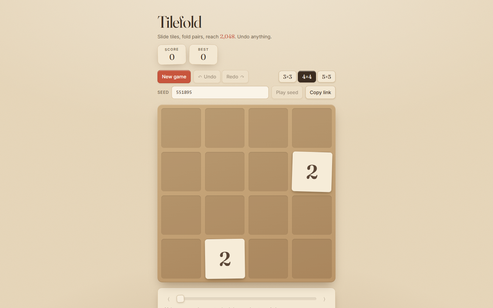

# Tilefold

A 2048-style merge-tile puzzle with unlimited undo, seeded deterministic runs, and a move-by-move replay scrubber.



Slide tiles with the arrow keys, fold equal pairs together, and chase 2048. Every move is an immutable snapshot, so you can undo as far back as you like, drag the scrubber through the whole game, press play to watch it back, and share a URL that reproduces the exact same board and moves for anyone who opens it.

## Features

- 4x4 grid with arrow-key, WASD (and hjkl) input, plus touch and mouse swipe
- Slide-and-merge engine with correct single-merge-per-move semantics
- Seeded mulberry32 PRNG: `?seed=31337` deals the same tiles every time, and `&m=DDLU...` carries the moves, so a link *is* the game
- Unlimited undo/redo backed by an array of immutable board snapshots
- Replay scrubber that steps through every move, with a play button that auto-steps at ~4 moves/s
- Game-over detection (no empty cells, no equal neighbours) and a win banner at 2048 (256 on the 3x3 board)
- Best score per board size persisted to localStorage
- Board-size selector (3x3, 4x4, 5x5) running the same engine
- Kraft-paper visual design: tilted paper tiles with soft shadows, oldstyle serif numerals (Fraunces), spring-eased slides and a paper "fold" flip on merge; respects `prefers-reduced-motion`

## How it works

The engine in `src/engine/` is a handful of pure functions with no React in sight. The only slide anyone ever writes is **slide left**. `traceRow` walks a row once, compressing non-zero cells toward index 0 and merging a cell into the previous output cell only if that cell has not already been produced by a merge this turn. That single flag is what makes `[2,2,2,2]` become `[4,4,0,0]` instead of `[8,0,0,0]`. To slide in any other direction, `slide(board, dir)` rotates the grid clockwise until that direction *is* left (down = 1 turn, right = 2, up = 3), slides every row, and rotates the result back. The trace (which input cell went to which output cell, and whether it folded into a neighbour) is rotated back the same way, so the UI knows exactly which tile moved where without any extra bookkeeping.

```
board          rotate CW x3     slide left        rotate CW x1
(slide up)     (up -> left)     per row           (back)
2 . . 2        2 . . .          2 . . .           4 8 . 2
. 4 . .   ->   . . . .    ->    . . . .    ->     . . . .
. 4 . .        . 4 4 .          8 . . .           . . . .
2 . . .        2 . . 2          4 . . .           . . . .
                                                  score +12
```

Randomness lives in a tiny functional [mulberry32](https://github.com/bryc/code/blob/master/jshash/PRNGs.md#mulberry32) generator. `nextFloat(rng)` returns a value *and* the next generator, never mutating anything, so the generator can sit inside a snapshot. `spawn` draws twice: once to pick an empty cell, once for the 90/10 split between a 2 and a 4. Because a move that changes nothing skips the spawn entirely, two games with the same seed and the same key presses are always identical, and a game can be rebuilt from `seed + size + move list` alone. That is all a share link contains.

The `Game` type is `{ seed, size, history: Snapshot[], cursor }`. A move appends a snapshot and advances the cursor; undo is `cursor - 1`, redo is `cursor + 1`, the scrubber is `cursor = n`, and playback is a timer calling redo. Moving while rewound truncates the discarded future, exactly like an editor's undo stack. Each snapshot carries tiles with stable ids (a merged tile keeps the id of the tile that stayed put, and the tile that folded into it is recorded as a "ghost" at its destination), which lets the React layer animate slides with a plain CSS transition on `transform` and run the fold/pop keyframes on the tiles the snapshot flags.

## Run it

```bash
npm install
npm run dev        # local dev server
npm run build      # type-check (tsc -b) + production build to dist/
npm run preview    # serve dist/
npm test           # vitest: engine, rng and history specs
```

Keyboard: arrows / WASD slide, `Z` undo, `Y` or `Shift+Z` redo, `Home` / `End` jump to the first / latest snapshot.

## Tech

- Vite 8, React 19, TypeScript 6 (strict, `erasableSyntaxOnly`)
- Tailwind CSS 4 via `@tailwindcss/vite`, with a small hand-written layer for tiles, animations and the range slider
- Vitest 5 for the engine tests (node environment, no DOM needed)
- `@fontsource-variable/fraunces` (optical-size axis, oldstyle numerals) and `@fontsource/inter`
- No runtime dependencies beyond React

## License

MIT, see [LICENSE](LICENSE).
